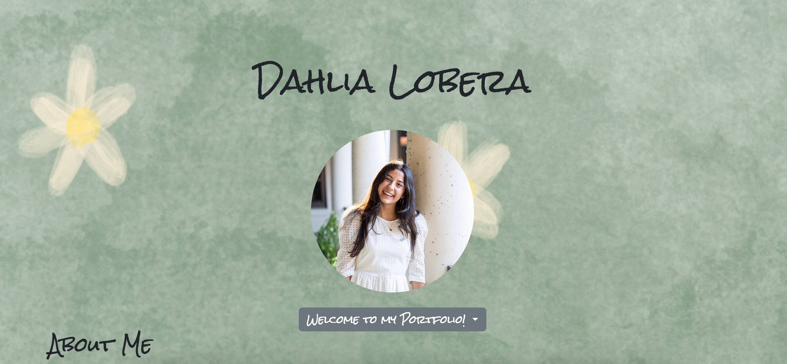

# dahlialobera-portfolio
</img>

My portfolio is a webpage that allows you to navigate through different sections labeled 'About me', 'Resume', 'Work', 'Skills'. I used HTML, CSS, and Javascript to make my portfolio user friendly and to add my MVP requirements.

<a href="https://dahlialobera-portfolio.netlify.app/">Navigate to my portfolio here.</a>

<h1>Technologies added.<h1>
  •CSS
  •HTML
  •Javascript
  •Git

<h2>Credits</h2>
  <ul>•Bootstrap dropdown bar added.</ul>
    <ul>•Orchid icon by Icons8.</ul>
     <ul>•Font is Rocksalt by Google fonts.</ul>
       <ul>•Automatic slideshow container from W3.</ul>
         <ul>•Media queries from W3.</ul>
            <ul>•Austin Skyline Image from PNGKey.</ul>
            <ul>•Icons from Ionic Icons</ul>
            <ul>•html,css and javascript photos from elharrahfonts.</ul>
            <ul>•Trello for Planning.</ul>
            <ul>•Whimsical for wireframe.</ul>
            <ul></ul>

<h3>Whats Next?</h3>
<ul>I will further work on adding more interaction to my page.</ul>
<ul>I will make it line up more with the theme of a garden to represent growth.</ul>